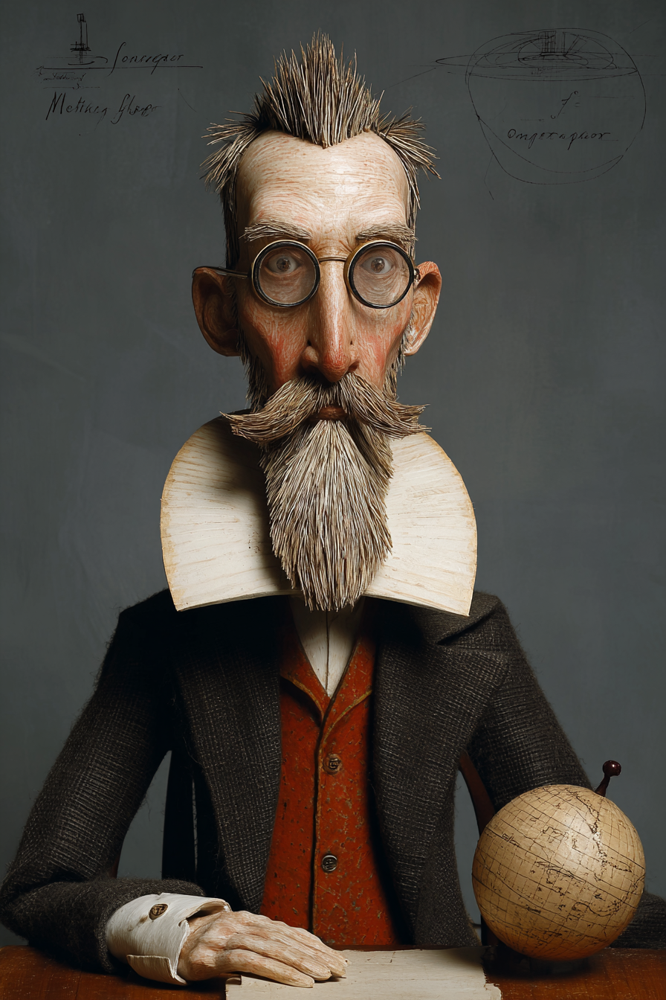

# Introduction — Wayback Sections

> Extracted from `chapters/`. Each entry corresponds to one chapter file.
> Sections are instructor-authored. Missing sections show a placeholder only.
> Do not edit this file directly — edit the source chapter file, then re-run extraction.

---

## Chapter 00: Introduction
*Source: `chapters/00-frontmatter.md`*

> **Section not yet authored.** No `## AI Wayback Machine` block found in this chapter file.
> To add this section, edit the source chapter file directly.

---

## Chapter 00: Introduction
*Source: `chapters/00-introduction.md`*

> **Section not yet authored.** No `## AI Wayback Machine` block found in this chapter file.
> To add this section, edit the source chapter file directly.

---

## Chapter 01: Chapter 1 — Prerequisites
*Source: `chapters/01-prerequisites.md`*

##  AI Wayback Machine

**Brahmagupta** wrote the *Brāhmasphuṭasiddhānta* in 628 CE — establishing rules for zero, negative numbers, and arithmetic with both. The number system that makes modern algebra possible begins with him.

**Run this:**

```
Who was Brahmagupta, and how does his work with zero and negative numbers connect to the algebraic prerequisites we covered in this chapter? Keep it to three paragraphs. End with the single most surprising thing about his career or ideas.
```

→ Search **"Brahmagupta"** on Wikipedia.

**Now make the prompt better.** Try one of these:

- Ask it to walk through Brahmagupta's specific rules for operations with zero — including the one rule (division by zero) he got wrong.
- Ask it about how Brahmagupta's ideas reached medieval Europe through Arabic translations.

What changes? What gets better? What gets worse?

---

## Chapter 02: Chapter 2 — Equations and Inequalities
*Source: `chapters/02-equations-and-inequalities.md`*

##  AI Wayback Machine

**Diophantus of Alexandria** wrote *Arithmetica* around 250 CE — the first systematic treatment of equations and unknowns. He invented much of the notation that classical algebra eventually formalized.

**Run this:**

```
Who was Diophantus of Alexandria, and how does his work on equations connect to what we covered in this chapter? Keep it to three paragraphs. End with the single most surprising thing about his career or ideas.
```

→ Search **"Diophantus"** on Wikipedia.

**Now make the prompt better.** Try one of these:

- Ask it to solve one of Diophantus's *Arithmetica* problems in modern notation.
- Ask it about the famous riddle of Diophantus's age (the epitaph problem) — and whether it's plausibly autobiographical.

What changes? What gets better? What gets worse?

---

## Chapter 03: Chapter 3 — Functions
*Source: `chapters/03-functions.md`*

##  AI Wayback Machine

**Leonhard Euler** introduced the modern function notation *f(x)* in 1734 — and built much of the theory of functions in the 1740s. His notation is so successful that we rarely notice it.


*Puppet Art by [Nik Bear Brown](https://www.nikbearbrown.com/).*

**Run this:**

```
Who was Leonhard Euler, and how does his work on functions connect to what we covered in this chapter? Keep it to three paragraphs. End with the single most surprising thing about his career or ideas.
```

→ Search **"Leonhard Euler"** on Wikipedia.

**Now make the prompt better.** Try one of these:

- Ask it to list five other pieces of standard mathematical notation we owe to Euler.
- Ask it about Euler's prolific output despite becoming blind in his later years.

What changes? What gets better? What gets worse?

---

## Chapter 04: Chapter 4 — Linear Functions
*Source: `chapters/04-linear-functions.md`*

##  AI Wayback Machine

**René Descartes** introduced the coordinate system bearing his name in *La Géométrie* in 1637 — letting algebra and geometry talk to each other for the first time. Every line graph and linear function lives on his grid.


*Puppet Art by [Nik Bear Brown](https://www.nikbearbrown.com/).*

**Run this:**

```
Who was René Descartes, and how does his coordinate system connect to the linear functions we covered in this chapter? Keep it to three paragraphs. End with the single most surprising thing about his career or ideas.
```

→ Search **"René Descartes"** on Wikipedia.

**Now make the prompt better.** Try one of these:

- Ask it to walk through how Descartes mapped one specific geometric problem onto algebra.
- Ask it about Descartes's parallel role in early modern philosophy — the cogito and beyond.

What changes? What gets better? What gets worse?

---

## Chapter 05: Chapter 5 — Polynomial and Rational Functions
*Source: `chapters/05-polynomial-and-rational-functions.md`*

##  AI Wayback Machine

**Évariste Galois** developed the theory connecting polynomial roots to group symmetries between 1828 and his death at age 20 in a duel — work that founded modern algebra. The night before the duel he wrote out as much of the theory as he could.

**Run this:**

```
Who was Évariste Galois, and how does his work on polynomials connect to what we covered in this chapter? Keep it to three paragraphs. End with the single most surprising thing about his career or ideas.
```

→ Search **"Évariste Galois"** on Wikipedia.

**Now make the prompt better.** Try one of these:

- Ask it to explain why fifth-degree polynomials have no general formula in terms of radicals — Galois's central result.
- Ask it about the duel — what we know and don't know about its cause.

What changes? What gets better? What gets worse?

---

## Chapter 06: Chapter 6 — Exponential and Logarithmic Functions
*Source: `chapters/06-exponential-and-logarithmic-functions.md`*

##  AI Wayback Machine

**John Napier** invented logarithms in 1614 — a calculation tool that reduced multiplication of large numbers to addition. His tables revolutionized astronomy and navigation by cutting computation time by a factor of ten.



*Puppet Art by [Nik Bear Brown](https://www.nikbearbrown.com/).*

**Run this:**

```
Who was John Napier, and how do logarithms connect to what we covered in this chapter? Keep it to three paragraphs. End with the single most surprising thing about his career or ideas.
```

→ Search **"John Napier"** on Wikipedia.

**Now make the prompt better.** Try one of these:

- Ask it to walk through how Napier's original logarithm tables would let an astronomer multiply two large numbers in seconds.
- Ask it about Napier's other inventions, including "Napier's bones" and a hydraulic screw for draining mines.

What changes? What gets better? What gets worse?

---

## Chapter 07: Chapter 7 — The Unit Circle: Sine and Cosine Functions
*Source: `chapters/07-the-unit-circle-sine-and-cosine-functions.md`*

##  AI Wayback Machine

**Madhava of Sangamagrama** developed the infinite series for sine and cosine in 14th-century Kerala — two centuries before Newton and Leibniz. The "Madhava-Leibniz series" for π is named jointly to recognize his priority.

**Run this:**

```
Who was Madhava of Sangamagrama, and how does his work on trigonometric series connect to the unit-circle sine and cosine functions we covered in this chapter? Keep it to three paragraphs. End with the single most surprising thing about his career or ideas.
```

→ Search **"Madhava of Sangamagrama"** on Wikipedia.

**Now make the prompt better.** Try one of these:

- Ask it to walk through Madhava's series for sin(x) and how it converges.
- Ask it about the Kerala school of astronomy and mathematics — and why its work was unknown to Europe for centuries.

What changes? What gets better? What gets worse?

---

## Chapter 08: Chapter 8 — Periodic Functions
*Source: `chapters/08-periodic-functions.md`*

##  AI Wayback Machine

**Joseph Fourier** showed in 1822 that any periodic function can be decomposed into a sum of sines and cosines — Fourier series. The result reshaped not only mathematics but also physics, signal processing, and modern audio compression.

**Run this:**

```
Who was Joseph Fourier, and how does Fourier analysis connect to the periodic functions we covered in this chapter? Keep it to three paragraphs. End with the single most surprising thing about his career or ideas.
```

→ Search **"Joseph Fourier"** on Wikipedia.

**Now make the prompt better.** Try one of these:

- Ask it to walk through how a square wave decomposes into a Fourier series — which sine and cosine terms add up to it?
- Ask it about Fourier's parallel role as governor of Egypt under Napoleon — and how that work shaped his physics.

What changes? What gets better? What gets worse?

---

## Chapter 09: Chapter 9 — Trigonometric Identities and Equations
*Source: `chapters/09-trigonometric-identities-and-equations.md`*

##  AI Wayback Machine

**Hipparchus of Nicaea** compiled the first known trigonometric table around 130 BCE — establishing trig as a discipline. Most of the identities we still teach today have a continuous lineage back to his calculations.


*Puppet Art by [Nik Bear Brown](https://www.nikbearbrown.com/).*

**Run this:**

```
Who was Hipparchus, and how does his trigonometric work connect to the identities and equations we covered in this chapter? Keep it to three paragraphs. End with the single most surprising thing about his career or ideas.
```

→ Search **"Hipparchus"** on Wikipedia.

**Now make the prompt better.** Try one of these:

- Ask it to walk through how Hipparchus used trigonometric ratios to compute astronomical distances.
- Ask it about Hipparchus's discovery of the precession of the equinoxes.

What changes? What gets better? What gets worse?

---

## Chapter 10: Chapter 10 — Further Applications of Trigonometry
*Source: `chapters/10-further-applications-of-trigonometry.md`*

##  AI Wayback Machine

**Bhāskara II** wrote the *Līlāvatī* in 12th-century India — a textbook of arithmetic, algebra, and trigonometry that became standard in Indian schools for centuries. Many trigonometric identities and applications we still teach were systematized by him.

**Run this:**

```
Who was Bhāskara II, and how does his work connect to the further applications of trigonometry we covered in this chapter? Keep it to three paragraphs. End with the single most surprising thing about his career or ideas.
```

→ Search **"Bhāskara II"** on Wikipedia.

**Now make the prompt better.** Try one of these:

- Ask it to solve one specific problem from the *Līlāvatī* using modern notation.
- Ask it about the legend of the *Līlāvatī* being written for Bhāskara's daughter — and whether it's likely true.

What changes? What gets better? What gets worse?

---

## Chapter 11: Chapter 11 — Systems of Equations and Inequalities
*Source: `chapters/11-systems-of-equations-and-inequalities.md`*

##  AI Wayback Machine

**Carl Friedrich Gauss** developed the method of elimination for solving systems of linear equations — now called Gaussian elimination — in 1809. His method is the basis of every modern computational linear-algebra routine.

**Run this:**

```
Who was Carl Friedrich Gauss, and how does Gaussian elimination connect to the systems of equations we covered in this chapter? Keep it to three paragraphs. End with the single most surprising thing about his career or ideas.
```

→ Search **"Carl Friedrich Gauss"** on Wikipedia.

**Now make the prompt better.** Try one of these:

- Ask it to walk through Gaussian elimination on a 3×3 system.
- Ask it about Gauss's habit of not publishing results — and what the field lost because of it.

What changes? What gets better? What gets worse?

---

## Chapter 12: Chapter 12 — Analytic Geometry
*Source: `chapters/12-analytic-geometry.md`*

##  AI Wayback Machine

**Pierre de Fermat** developed analytic geometry independently of (and slightly before) Descartes — though Descartes published first. Fermat's *Ad Locos Planos et Solidos Isagoge* showed how algebraic equations could describe curves.

**Run this:**

```
Who was Pierre de Fermat, and how does his analytic geometry work connect to what we covered in this chapter? Keep it to three paragraphs. End with the single most surprising thing about his career or ideas.
```

→ Search **"Pierre de Fermat"** on Wikipedia.

**Now make the prompt better.** Try one of these:

- Ask it to compare Fermat's and Descartes's versions of analytic geometry — what each got right.
- Ask it about Fermat's day job as a magistrate, and how mathematics fit into a working lawyer's life.

What changes? What gets better? What gets worse?

---

## Chapter 13: Chapter 13 — Sequences, Probability, and Counting Theory
*Source: `chapters/13-sequences-probability-and-counting-theory.md`*

##  AI Wayback Machine

**Sofia Kovalevskaya** was the first woman to earn a doctorate in mathematics (in 1874) — and her later work on partial differential equations, combinatorics, and elliptic functions reshaped multiple subfields. She spent most of her career at the University of Stockholm because no Russian university would hire her.

**Run this:**

```
Who was Sofia Kovalevskaya, and how does her mathematical work connect to the sequences, probability, and counting theory we covered in this chapter? Keep it to three paragraphs. End with the single most surprising thing about her career or ideas.
```

→ Search **"Sofya Kovalevskaya"** on Wikipedia.

**Now make the prompt better.** Try one of these:

- Ask it about Kovalevskaya's "Cauchy-Kovalevskaya theorem" and what it does for partial differential equations.
- Ask it about her parallel career as a novelist and the autobiographical novel *Nihilist Girl*.

What changes? What gets better? What gets worse?

---

## Chapter 99: 99 Back Matter
*Source: `chapters/99-back-matter.md`*

> **Section not yet authored.** No `## AI Wayback Machine` block found in this chapter file.
> To add this section, edit the source chapter file directly.

---
